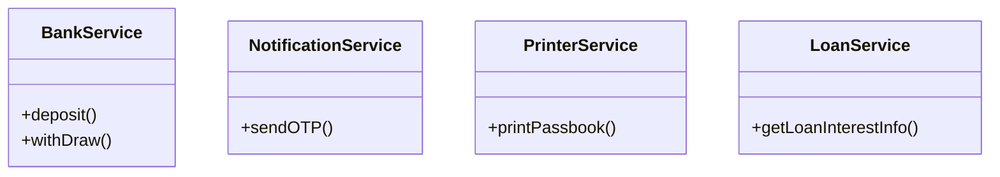
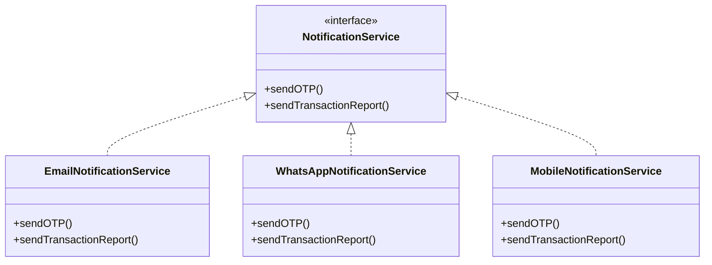
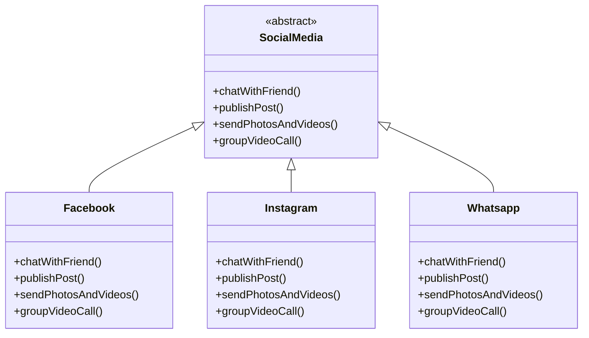
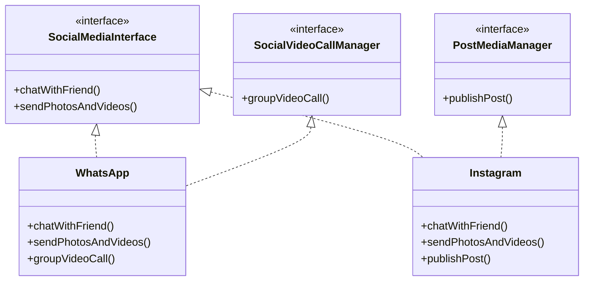
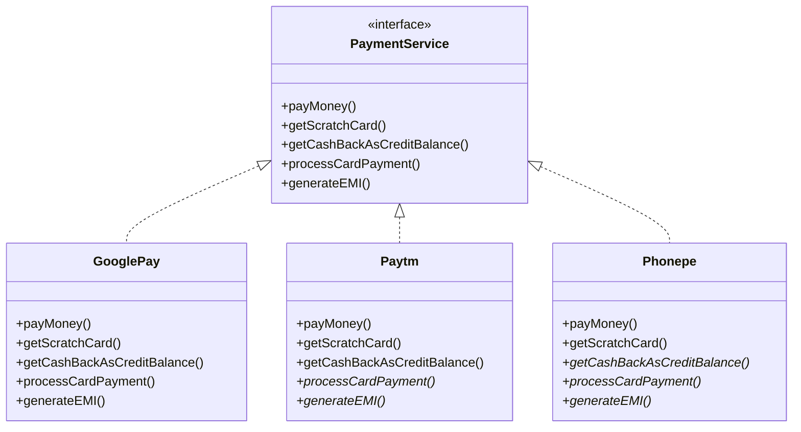
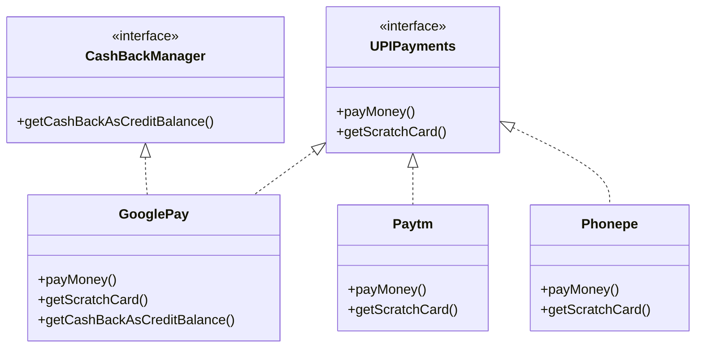
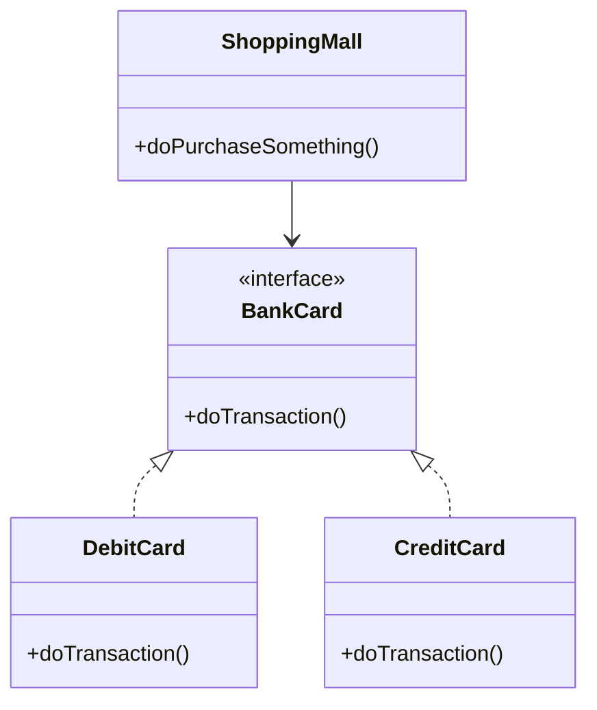

# SOLID Principles in Java: SDE2 Interview Study Guide

*Prepared for Senior Software Engineer (SDE2) Interview Preparation*

This guide provides a comprehensive exploration of SOLID design principles in Java, focusing on practical application, architectural implications, and real-world trade-offs. Designed for SDE2 candidates, it emphasizes refactoring techniques, system design integration, and interview scenarios.

## Introduction

SOLID is an acronym for five fundamental object-oriented design principles that promote maintainable, scalable, and testable software:

- **S**ingle Responsibility Principle
- **O**pen-Closed Principle
- **L**iskov Substitution Principle
- **I**nterface Segregation Principle
- **D**ependency Inversion Principle

These principles are crucial for building robust systems, whether monolithic applications or microservices architectures. They reduce coupling, improve testability, and enable easier evolution of codebases. In microservices, SOLID principles guide API design and service boundaries; in monoliths, they prevent the accumulation of technical debt.

> **Key Takeaway**: SOLID principles are not rigid rules but guidelines for better software design. Over-application can lead to unnecessary complexity.

## Single Responsibility Principle (SRP)

### Definition
**Formal**: A class should have only one reason to change, meaning it should have only one responsibility.

**Plain English**: Each class should do one thing well and have a single purpose.

### The "Why"
SRP addresses code fragility and rigidity. Classes with multiple responsibilities become "god objects" that are hard to maintain, test, and reuse. Changes in one responsibility can break others, leading to cascading failures.

### Java Implementation

#### The "Bad" Way: Violation Example
```java
// Violation: NotificationService handles multiple notification types
public class NotificationService {
    public void sendOTP(String medium) {
        if (medium.equals("email")) {
            //write email related logic
            //use JavaMailSenderAPI
        }
        if(medium.equals("mobile")){
            //write logic using twillio API
        }
    }
}
```

#### The "Good" Way: Refactored Implementation
```java
// Responsibility: Handle bank deposits and withdrawals
public class BankService {

    public long deposit(long amount, String accountNo) {
        //deposit amount
        return 0;
    }

    public long withDraw(long amount, String accountNo) {
        //withdraw amount
        return 0;
    }
}

// Responsibility: Send notifications via different mediums
public class NotificationService {
    public void sendOTP(String medium) {
        if (medium.equals("email")) {
            //write email related logic
            //use JavaMailSenderAPI
        }
        if(medium.equals("mobile")){
            //write logic using twillio API
        }
    }
}

// Responsibility: Print passbook
public class PrinterService {

    public void printPassbook() {
        //update transaction info in passbook
    }
}

// Responsibility: Provide loan interest information
public class LoanService {

    public void getLoanInterestInfo(String loanType) {
        if (loanType.equals("homeLoan")) {
            //do some job
        }
        if (loanType.equals("personalLoan")) {
            //do some job
        }
        if (loanType.equals("car")) {
            //do some job
        }
    }
}
```

### SDE2 Focus: Edge Cases & Trade-offs
- **When NOT to apply**: In simple CRUD applications or prototypes where separation adds unnecessary complexity
- **Trade-off**: More classes increase initial development time but improve long-term maintainability
- **Edge case**: Utility classes (e.g., StringUtils) can have multiple related methods if they're cohesive

### UML/Visuals: Class Diagrams

#### SRP Compliant Design


**Interview Notes on Classes vs Interfaces vs Abstract Classes:**
- **Concrete Classes**: Use for complete implementations (like `BankService`). They can be instantiated and provide full functionality.
- **Abstract Classes**: Use when you want to provide some default behavior but force subclasses to implement certain methods. Good for inheritance hierarchies where common state/behavior exists.
- **Interfaces**: Use for contracts without implementation. Perfect for polymorphism and dependency injection. In Java 8+, interfaces can have default methods, but avoid overusing them.
- **When to choose what**: Use interfaces for "has-a" relationships, abstract classes for "is-a" with shared implementation. Interfaces are preferred in modern Java for better testability and flexibility.

## Open-Closed Principle (OCP)

### Definition
**Formal**: Software entities should be open for extension but closed for modification.

**Plain English**: You should be able to add new functionality without changing existing code.

### The "Why"
OCP prevents regression bugs and reduces the risk of introducing errors when adding features. It promotes polymorphism and abstraction over conditional logic.

### Java Implementation

#### The "Bad" Way: Violation Example
```java
// Violation: Adding new notification types requires modifying existing code
public class NotificationService {
    public void sendNotification(String type, String message) {
        if (type.equals("email")) {
            // Email logic
            System.out.println("Sending email: " + message);
            // Code to send email using SMTP
        } else if (type.equals("sms")) {
            // SMS logic
            System.out.println("Sending SMS: " + message);
            // Code to send SMS using Twilio API
        } else if (type.equals("push")) {
            // Push notification logic
            System.out.println("Sending push notification: " + message);
            // Code to send push notification using FCM
        }
        // To add WhatsApp notifications, we need to modify this class!
    }
}

// Usage - tightly coupled and hard to extend
public class OrderService {
    private NotificationService notificationService = new NotificationService();

    public void processOrder(Order order) {
        // Process order logic...
        notificationService.sendNotification("email", "Order confirmed: " + order.getId());
    }
}
```

#### The "Good" Way: Refactored Implementation
```java
// Abstraction: Notification service interface - open for extension
public interface Notificationservice {

    public void sendOTP(String medium);

    public void sendTransactionReport(String medium);

}

// Email notification implementation
public class EmailNotificationService implements Notificationservice {
    public void sendOTP(String medium) {
        //write logic to integrate with email api

    }

    public void sendTransactionReport(String medium) {
        //write logic to integrate with email api
    }
}

// WhatsApp notification implementation
public class WhatsAppNotificationService implements Notificationservice {

    public void sendOTP(String medium) {
        //logic to integrate whatsapp api
    }

    public void sendTransactionReport(String medium) {
//logic to integrate whatsapp api
    }
}

// Mobile notification implementation
public class MobileNotificationService implements Notificationservice {
    public void sendOTP(String medium) {
        //write the logic to send otp to mobile
        //twillo api

    }

    public void sendTransactionReport(String medium) {
        //write the logic to send otp to mobile
        //twillo api
    }
}
```

### SDE2 Focus: Edge Cases & Trade-offs
- **When NOT to apply**: For stable, unchanging codebases or when abstraction overhead outweighs benefits
- **Trade-off**: More interfaces/classes increase complexity but enable plugin architectures
- **Edge case**: Strategy pattern vs. inheritance - choose based on variability patterns

### UML/Visuals: Class Diagrams

#### OCP Compliant Design


**Interview Notes on OCP and Extensibility:**
- **Strategy Pattern**: Often used with OCP - inject different strategies (implementations) at runtime.
- **Plugin Architecture**: OCP enables systems where new features can be added as plugins without touching core code.
- **Configuration over Code**: Use config files or dependency injection to choose implementations at runtime.
- **Common Interview Question**: "How would you design a notification system that can easily add new channels?" Answer: Interface-based design with factory pattern.

## Liskov Substitution Principle (LSP)

### Definition
**Formal**: Objects of a superclass should be replaceable with objects of its subclasses without affecting the correctness of the program.

**Plain English**: Subclasses should behave in a way that doesn't break the expectations set by the superclass.

### The "Why"
LSP ensures behavioral subtyping, preventing unexpected behavior in polymorphic code. It maintains the contract of the superclass.

### Java Implementation

#### The "Bad" Way: Violation Example
```java
// Violation: Subclasses don't support all parent methods properly
public abstract class SocialMedia {

    //@support WhatsApp,Facebook,Instagram
    public abstract  void chatWithFriend();

    //@support Facebook,Instagram
    public abstract void publishPost(Object post);

    //@support WhatsApp,Facebook,Instagram
    public abstract  void sendPhotosAndVideos();

    //@support WhatsApp,Facebook
    public abstract  void groupVideoCall(String... users);
}

public class Instagram extends SocialMedia {

    public void chatWithFriend() {

    }

    public void publishPost(Object post) {

    }

    public void sendPhotosAndVideos() {

    }

    public void groupVideoCall(String... users) {
//not applicable
    }
}
```

#### The "Good" Way: Refactored Implementation
```java
// Proper abstraction: Segregated interfaces
public interface SocialMedia {

    public   void chatWithFriend();

    public   void sendPhotosAndVideos();

}

public interface PostMediaManager {

    public  void publishPost(Object post);
}

public interface SocialVideoCallManager {
    public void groupVideoCall(String... users);
}

public class WhatsApp implements SocialMedia,SocialVideoCallManager {
    public void chatWithFriend() {

    }

    public void sendPhotosAndVideos() {

    }

    public void groupVideoCall(String... users) {

    }
}

public class Instagram implements SocialMedia,PostMediaManager{

    public void publishPost(Object post) {

    }

    public void chatWithFriend() {

    }

    public void sendPhotosAndVideos() {

    }
}
```
    public void processShapeWithPattern(Object obj) {
        if (obj instanceof Rectangle rect) {
            System.out.println("Rectangle: " + rect.getWidth() + "x" + rect.getHeight());
        } else if (obj instanceof Square square) {
            System.out.println("Square: " + square.getSide() + "x" + square.getSide());
        }
    }
}
```

### SDE2 Focus: Edge Cases & Trade-offs
- **When NOT to apply**: For final classes or when inheritance isn't needed
- **Trade-off**: More interfaces increase design complexity but ensure correct polymorphism
- **Edge case**: Method overriding should not weaken preconditions or strengthen postconditions

### UML/Visuals: Class Diagrams

#### Before (Violation)


#### After (LSP Compliant)


**Interview Notes on LSP and Inheritance:**
- **Composition over Inheritance**: When LSP is violated, prefer composition. Ask: "Should these classes really inherit, or should they compose?"
- **Contract Design**: LSP is about behavioral contracts. Subtypes must honor the contract of the supertype.
- **Common Violation**: Empty implementations or throwing UnsupportedOperationException.
- **Tell-Don't-Ask**: Instead of checking types, design interfaces so clients don't need to know concrete types.
- **Interview Question**: "How do you ensure LSP in your design?" Answer: Design by contract, comprehensive testing, avoid type checking.

## Interface Segregation Principle (ISP)

### Definition
**Formal**: Clients should not be forced to depend on interfaces they do not use.

**Plain English**: Don't make interfaces too broad; split them into smaller, specific interfaces.

### The "Why"
ISP reduces coupling between classes and prevents clients from depending on methods they don't need. It promotes focused, cohesive interfaces.

### Java Implementation

#### The "Bad" Way: Violation Example
```java
// Violation: Fat interface combining all payment methods
public interface PaymentService {
    void payMoney();           // UPI payments
    void getScratchCard();     // UPI payments
    void getCashBackAsCreditBalance(); // Cashback feature
    void processCardPayment(); // Card payments
    void generateEMI();        // Loan/EMI feature
}

// Google Pay - supports all features
public class GooglePay implements PaymentService {
    @Override
    public void payMoney() {
        System.out.println("Google Pay: Processing UPI payment...");
    }

    @Override
    public void getScratchCard() {
        System.out.println("Google Pay: Generating scratch card...");
    }

    @Override
    public void getCashBackAsCreditBalance() {
        System.out.println("Google Pay: Applying cashback...");
    }

    @Override
    public void processCardPayment() {
        System.out.println("Google Pay: Processing card payment...");
    }

    @Override
    public void generateEMI() {
        System.out.println("Google Pay: Generating EMI options...");
    }
}

// Paytm - only supports UPI and cashback, but forced to implement card and EMI
public class Paytm implements PaymentService {
    @Override
    public void payMoney() {
        System.out.println("Paytm: Processing UPI payment...");
    }

    @Override
    public void getScratchCard() {
        System.out.println("Paytm: Generating scratch card...");
    }

    @Override
    public void getCashBackAsCreditBalance() {
        System.out.println("Paytm: Applying cashback...");
    }

    @Override
    public void processCardPayment() {
        // Paytm doesn't support card payments!
        throw new UnsupportedOperationException("Card payments not supported by Paytm");
    }

    @Override
    public void generateEMI() {
        // Paytm doesn't offer EMI services!
        throw new UnsupportedOperationException("EMI services not available on Paytm");
    }
}

// PhonePe - only supports UPI, but forced to implement cashback, card, and EMI
public class PhonePe implements PaymentService {
    @Override
    public void payMoney() {
        System.out.println("PhonePe: Processing UPI payment...");
    }

    @Override
    public void getScratchCard() {
        System.out.println("PhonePe: Generating scratch card...");
    }

    @Override
    public void getCashBackAsCreditBalance() {
        // PhonePe doesn't offer cashback!
        throw new UnsupportedOperationException("Cashback not available on PhonePe");
    }

    @Override
    public void processCardPayment() {
        // PhonePe doesn't support card payments!
        throw new UnsupportedOperationException("Card payments not supported by PhonePe");
    }

    @Override
    public void generateEMI() {
        // PhonePe doesn't offer EMI!
        throw new UnsupportedOperationException("EMI services not available on PhonePe");
    }
}
```

#### The "Good" Way: Refactored Implementation
```java
// Segregated interfaces for different payment features
public interface UPIPayments {

    public void payMoney();

    public void getScratchCard();


}

public interface CashBackManager {

    public void getCashBackAsCreditBalance();
}

// Google Pay implements both interfaces
public class GooglePay implements UPIPayments,CashBackManager {

    public void payMoney() {

    }

    public void getScratchCard() {

    }

    public void getCashBackAsCreditBalance() {
      //this features is there in gpay
    }
}

// Paytm implements only UPIPayments
public class Paytm implements UPIPayments {

    public void payMoney() {

    }

    public void getScratchCard() {

    }


}

// Phonepe implements only UPIPayments
public class Phonepe implements UPIPayments {
    public void payMoney() {

    }

    public void getScratchCard() {

    }


}
```

### SDE2 Focus: Edge Cases & Trade-offs
- **When NOT to apply**: For stable, small interfaces or when splitting increases complexity unnecessarily
- **Trade-off**: More interfaces improve modularity but can complicate client code
- **Edge case**: Role interfaces vs. header interfaces - use role interfaces for ISP compliance

### UML/Visuals: Class Diagrams

#### Before (Violation)

*Methods marked with * throw UnsupportedOperationException

#### After (ISP Compliant)


**Interview Notes on ISP and Interface Design:**
- **Role Interfaces**: Design interfaces around client needs, not implementation capabilities.
- **Multiple Inheritance Problem**: Java doesn't have multiple inheritance, but multiple interfaces solve this.
- **Fat Interfaces**: Signs of violation - methods that throw exceptions or return null.
- **Interface Pollution**: Avoid adding methods to interfaces just because one client needs them.
- **Interview Question**: "How do you decide what methods go in an interface?" Answer: Group methods that are always used together by the same clients.

## Dependency Inversion Principle (DIP)

### Definition
**Formal**: High-level modules should not depend on low-level modules. Both should depend on abstractions. Abstractions should not depend on details. Details should depend on abstractions.

**Plain English**: Depend on interfaces, not concrete classes. Inject dependencies rather than creating them.

### The "Why"
DIP enables loose coupling, easier testing, and flexibility in swapping implementations. It promotes the Dependency Injection pattern.

### Java Implementation

#### The "Bad" Way: Violation Example
```java
// Violation: High-level module depends directly on low-level modules
public class MySQLDatabase {
    public void connect() {
        System.out.println("Connecting to MySQL database...");
    }

    public void save(String data) {
        System.out.println("Saving data to MySQL: " + data);
    }
}

public class PostgreSQLDatabase {
    public void connect() {
        System.out.println("Connecting to PostgreSQL database...");
    }

    public void save(String data) {
        System.out.println("Saving data to PostgreSQL: " + data);
    }
}

// High-level module depends on concrete implementations
public class UserService {
    private MySQLDatabase database; // Tightly coupled to MySQL

    public UserService() {
        this.database = new MySQLDatabase(); // Direct instantiation
    }

    public void saveUser(String userData) {
        database.connect();
        database.save(userData);
    }

    // To switch to PostgreSQL, we need to modify UserService!
    public void switchToPostgreSQL() {
        // This violates OCP - we have to modify existing code
        this.database = new PostgreSQLDatabase();
    }
}

// Another high-level module with the same problem
public class OrderService {
    private MySQLDatabase database; // Again, tightly coupled

    public OrderService() {
        this.database = new MySQLDatabase();
    }

    public void saveOrder(String orderData) {
        database.connect();
        database.save(orderData);
    }
}
```

#### The "Good" Way: Refactored Implementation
```java
// Abstraction: BankCard interface
public interface BankCard {

    public void doTransaction(long amount);
}

// Low-level modules: Concrete implementations
public class DebitCard implements BankCard{

    public void doTransaction(long amount){
        System.out.println("payment using Debit card");
    }
}

public class CreditCard implements BankCard{

    public void doTransaction(long amount){
        System.out.println("payment using Credit card");
    }
}

// High-level module: Depends on abstraction, not concrete classes
public class ShoppingMall {

    private BankCard bankCard;

    public ShoppingMall(BankCard bankCard) {
        this.bankCard = bankCard;
    }

    public void doPurchaseSomething(long amount){
        bankCard.doTransaction(amount);
    }

    public static void main(String[] args) {
       // DebitCard debitCard=new DebitCard();
       // CreditCard creditCard=new CreditCard();

        BankCard bankCard=new CreditCard();
        ShoppingMall shoppingMall=new ShoppingMall(bankCard);
        shoppingMall.doPurchaseSomething(5000);
    }
}
```
```

### SDE2 Focus: Edge Cases & Trade-offs
- **When NOT to apply**: For simple applications or when dependencies are stable and unlikely to change
- **Trade-off**: Dependency injection adds complexity but enables better testing and flexibility
- **Edge case**: Service locator vs. dependency injection - prefer DI for testability

### UML/Visuals: Class Diagrams

#### DIP Compliant Design


**Interview Notes on DIP and Dependency Management:**
- **Dependency Injection**: Constructor, setter, or field injection. Frameworks like Spring make this easier.
- **Inversion of Control (IoC)**: Don't call us, we'll call you. Frameworks control object lifecycle.
- **Factory Pattern**: Often used with DIP to create appropriate implementations.
- **Service Locator**: Alternative to DI, but less testable.
- **Interview Question**: "How do you handle dependencies in your code?" Answer: Prefer constructor injection, use interfaces, avoid concrete class dependencies.
- **Testing Benefits**: DIP makes unit testing easier by allowing mock injection.

## System Design Context

SOLID principles extend beyond class-level design to influence high-level architecture:

### Microservices Architecture
- **SRP**: Each microservice should have a single responsibility (e.g., User Service, Order Service)
- **OCP**: Services should be extensible through API versioning without breaking existing clients
- **LSP**: API contracts must be substitutable (e.g., different implementations of the same service interface)
- **ISP**: APIs should expose only necessary endpoints; avoid bloated service interfaces
- **DIP**: Services depend on abstractions (interfaces) rather than concrete implementations

### API Design Example
```java
// ISP in API design: Segregated service interfaces
public interface UserService {
    User getUser(String id);
    List<User> getUsers();
}

public interface UserManagementService {
    void createUser(User user);
    void updateUser(User user);
    void deleteUser(String id);
}

// DIP: Controllers depend on interfaces
@RestController
public class UserController {
    private final UserService userService;
    private final UserManagementService managementService;

    public UserController(UserService userService, UserManagementService managementService) {
        this.userService = userService;
        this.managementService = managementService;
    }
}
```

### Database Design
- **SRP**: Separate read and write models (CQRS pattern)
- **OCP**: Database schemas extensible through migrations
- **ISP**: Different repositories for different entity operations

## Interview "Gotchas" & Q&A

### Single Responsibility Principle
1. **Question**: "How do you identify when a class violates SRP?"
   - **STAR Answer**: Situation: Working on a legacy UserService class handling authentication, profile management, and email notifications. Task: Refactor for better maintainability. Action: Split into UserAuthenticationService, UserProfileService, and EmailNotificationService. Result: Improved testability and reduced coupling.

2. **Question**: "What's the difference between SRP and separation of concerns?"
   - SRP focuses on classes having one reason to change, while separation of concerns is broader, applying to any level of abstraction.

### Open-Closed Principle
1. **Question**: "Explain a time you refactored code to adhere to OCP."
   - **STAR Answer**: Situation: Payment processing system with if-else chains for different payment methods. Task: Add new payment types without modifying existing code. Action: Created PaymentProcessor interface with implementations for CreditCard, PayPal, etc. Result: New payment methods added by implementing the interface.

2. **Question**: "When would you violate OCP intentionally?"
   - For stable, unchanging code or when the cost of abstraction outweighs the benefits.

### Liskov Substitution Principle
1. **Question**: "How do you ensure LSP compliance in your designs?"
   - Design by contract: Preconditions, postconditions, and invariants must be preserved in subclasses.

2. **Question**: "Give an example of LSP violation in Java collections."
   - ArrayList vs. LinkedList: Both implement List interface correctly, but have different performance characteristics.

### Interface Segregation Principle
1. **Question**: "How does ISP relate to microservices design?"
   - Each microservice should expose focused APIs rather than monolithic interfaces.

2. **Question**: "What's the trade-off of applying ISP?"
   - More interfaces improve modularity but can increase complexity and make client code harder to understand.

### Dependency Inversion Principle
1. **Question**: "How do you implement DIP in a Spring Boot application?"
   - Use @Autowired or constructor injection to inject interface dependencies rather than concrete classes.

2. **Question**: "Compare DIP with Dependency Injection."
   - DIP is a principle; DI is a pattern that implements DIP by injecting dependencies from outside.

> **Pro Tip**: In interviews, always discuss trade-offs and when you might choose not to apply a principle. Show awareness of context and practical constraints.

## Interview-Ready Notes: Interfaces, Abstract Classes, and Design Patterns

### When to Use Interfaces vs Abstract Classes

**Use Interfaces When:**
- You want to define a contract without any implementation
- Multiple inheritance is needed (Java doesn't support multiple inheritance with classes)
- You want to achieve loose coupling and testability
- The implementation can vary completely across different classes
- You want to support polymorphism across unrelated classes

**Use Abstract Classes When:**
- You want to provide default implementations for some methods
- You have common state or behavior that subclasses should inherit
- You want to enforce a certain structure while allowing customization
- All implementations share a common base functionality
- You need to maintain state across the hierarchy

**Interview Examples:**
- **Interface**: `List` - multiple implementations (ArrayList, LinkedList) with different behaviors
- **Abstract Class**: `AbstractList` - provides skeletal implementation for List interface

### Common Design Patterns with SOLID

**Strategy Pattern (OCP + DIP):**
```java
interface PaymentStrategy {
    void pay(double amount);
}
class CreditCardStrategy implements PaymentStrategy { /* impl */ }
class PayPalStrategy implements PaymentStrategy { /* impl */ }
class PaymentProcessor {
    private PaymentStrategy strategy;
    // Constructor injection
}
```

**Factory Pattern (DIP + OCP):**
```java
interface NotificationFactory {
    NotificationService createService();
}
class EmailFactory implements NotificationFactory { /* returns EmailService */ }
```

**Template Method (OCP + LSP):**
```java
abstract class DataProcessor {
    public final void process() {
        readData();
        processData();
        saveData();
    }
    protected abstract void processData();
}
```

### SOLID in Modern Java (Java 8+)

**Default Methods in Interfaces:**
- Allow adding methods to interfaces without breaking implementations
- But use sparingly - can lead to diamond problem complexities
- Good for optional enhancements

**Functional Interfaces and Lambdas:**
- Enable Strategy pattern without anonymous classes
- Perfect for OCP implementations

**Records (Java 14+):**
- Immutable data classes
- Automatically implement equals, hashCode, toString
- Great for DTOs and value objects in SOLID designs

### Common Interview Questions & Answers

**Q: How do you choose between interface and abstract class?**
A: Use interfaces for contracts and polymorphism. Use abstract classes when you need shared implementation or state. Prefer interfaces for better testability and flexibility.

**Q: What happens if you violate LSP?**
A: Code becomes fragile, clients need instanceof checks, breaks polymorphism. Leads to runtime errors and maintenance nightmares.

**Q: How does DIP relate to testing?**
A: DIP enables dependency injection, making it easy to inject mocks/stubs for unit testing. High cohesion, low coupling improves testability.

**Q: When would you NOT apply SOLID?**
A: Simple scripts, prototypes, legacy code maintenance, performance-critical code where abstraction overhead is costly, or when team size/constraints don't justify the complexity.

**Q: How do you refactor to SOLID?**
A: Start with SRP (extract methods/classes), then OCP (introduce interfaces), LSP (fix inheritance), ISP (split interfaces), DIP (inject dependencies). Use TDD to guide the process.

## Is-a vs Has-a Relationships: Inheritance vs Composition

### Is-a Relationship (Inheritance)
**Definition**: A subclass "is-a" type of its superclass. It represents a hierarchical relationship where the subclass inherits properties and behaviors from the superclass.

**When to Use**: 
- When there's a true hierarchical relationship
- When subclasses share common behavior and state
- When polymorphism is needed (Liskov Substitution Principle)

**Java Implementation**: `extends` keyword for classes, `implements` for interfaces

**Examples from SOLID:**
```java
// Good: WhatsApp IS-A SocialMediaInterface
public class WhatsApp implements SocialMediaInterface {
    // WhatsApp has all the behaviors of SocialMediaInterface
}

// Bad (violates LSP): Instagram IS-A SocialMedia but doesn't support all methods
public class Instagram extends SocialMedia { // Wrong inheritance
    public void groupVideoCall(String... users) {
        // Not applicable - violates LSP
    }
}
```

**Interview Notes**: 
- Use inheritance when the relationship will never change
- Prefer interfaces over abstract classes for "is-a" relationships
- Always check if LSP is maintained

### Has-a Relationship (Composition)
**Definition**: A class "has-a" instance of another class as a member. It represents a whole-part relationship where one object contains or is composed of other objects.

**When to Use**:
- When you want to reuse code without inheritance
- When the relationship is dynamic and can change at runtime
- When you want to avoid the limitations of single inheritance
- When you need more flexibility than inheritance provides

**Java Implementation**: Member variables, dependency injection, composition

**Examples from SOLID:**
```java
// ShoppingMall HAS-A BankCard (composition)
public class ShoppingMall {
    private BankCard bankCard; // Has-a relationship
    
    public ShoppingMall(BankCard bankCard) { // Constructor injection
        this.bankCard = bankCard;
    }
}

// NotificationService HAS-A list of strategies (composition)
public class NotificationService {
    private List<NotificationStrategy> strategies; // Has-a relationship
}
```

**Interview Notes**:
- Composition is more flexible than inheritance
- Allows runtime changes (Strategy pattern)
- Avoids the diamond problem of multiple inheritance
- Easier to test (can inject mocks)

### Is-a vs Has-a: Decision Guide

| Aspect | Is-a (Inheritance) | Has-a (Composition) |
|--------|-------------------|-------------------|
| **Relationship** | Hierarchical | Whole-part |
| **Coupling** | Tight | Loose |
| **Flexibility** | Low | High |
| **Runtime Change** | Difficult | Easy |
| **Code Reuse** | Through inheritance | Through delegation |
| **SOLID Principle** | LSP must be maintained | DIP encourages this |

**Common Interview Question**: "When would you use inheritance vs composition?"
**Answer**: Use inheritance for "is-a" relationships where the subclass is truly a specialized version of the superclass and LSP is maintained. Use composition for "has-a" relationships when you need flexibility, runtime configurability, or to avoid inheritance's limitations.

**Real-World Examples**:
- **Is-a**: `ArrayList` is-a `List`, `Car` is-a `Vehicle`
- **Has-a**: `Car` has-a `Engine`, `Computer` has-a `CPU`, `Restaurant` has-a `Menu`

**In SOLID Context**:
- **SRP**: Both can help, but composition often leads to smaller, focused classes
- **OCP**: Composition enables extension through new components
- **LSP**: Inheritance must maintain substitutability
- **ISP**: Composition with interfaces avoids fat interfaces
- **DIP**: Composition naturally leads to dependency on abstractions