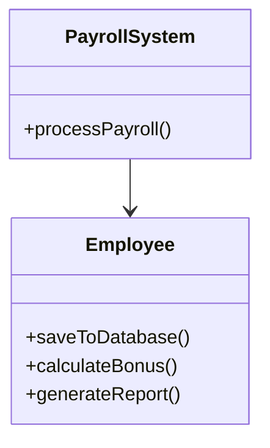
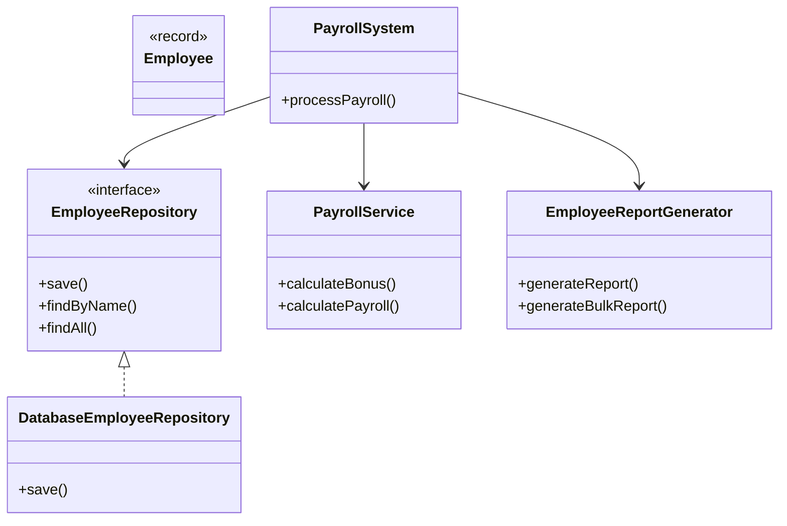
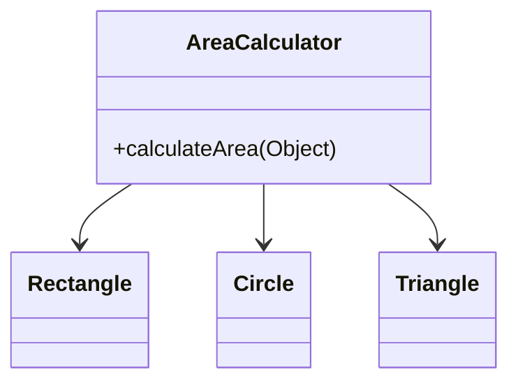
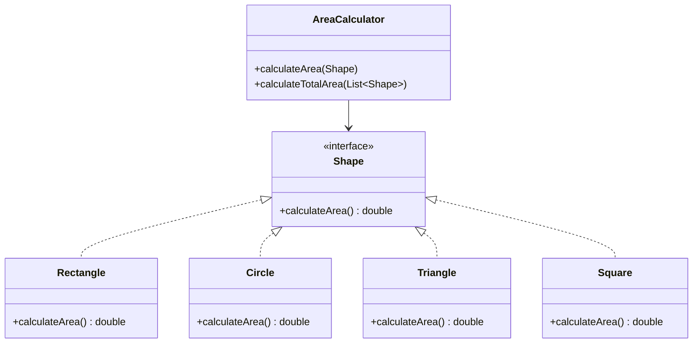
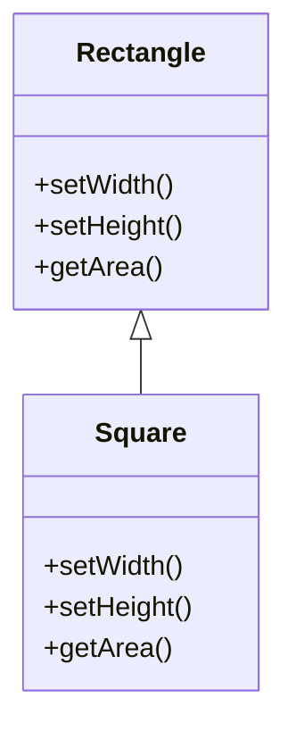
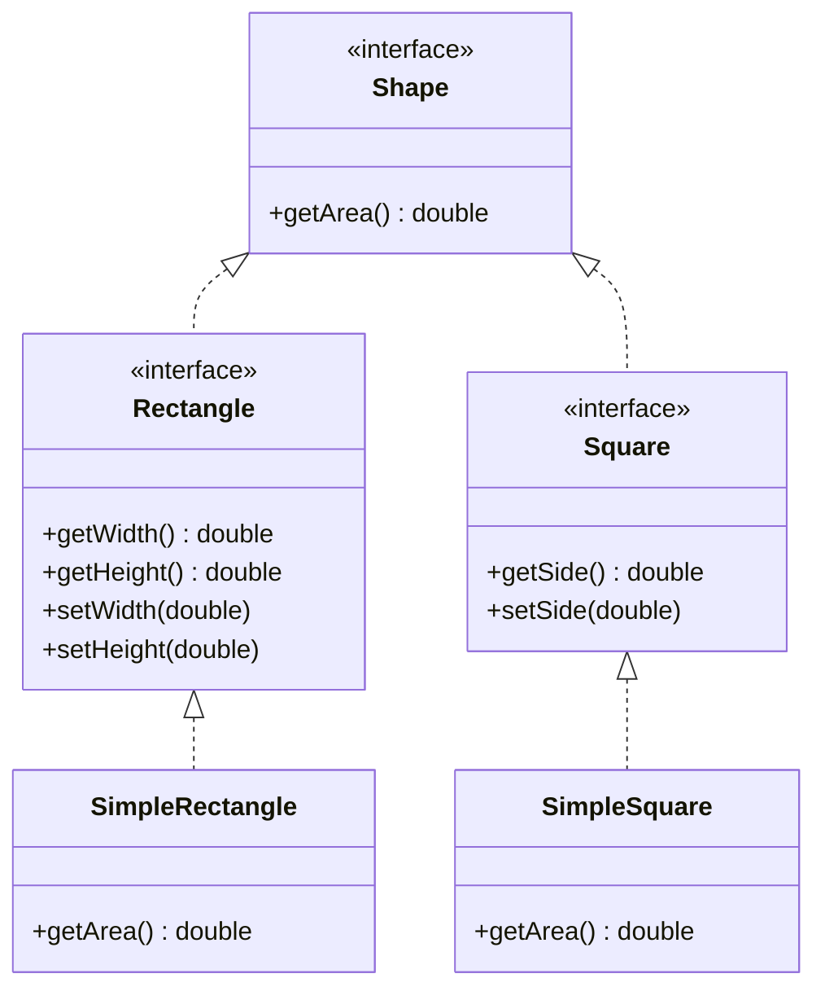
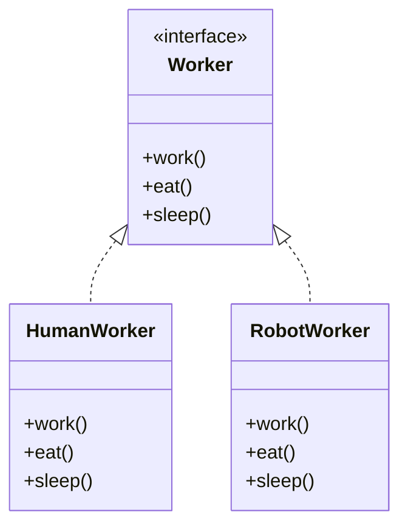
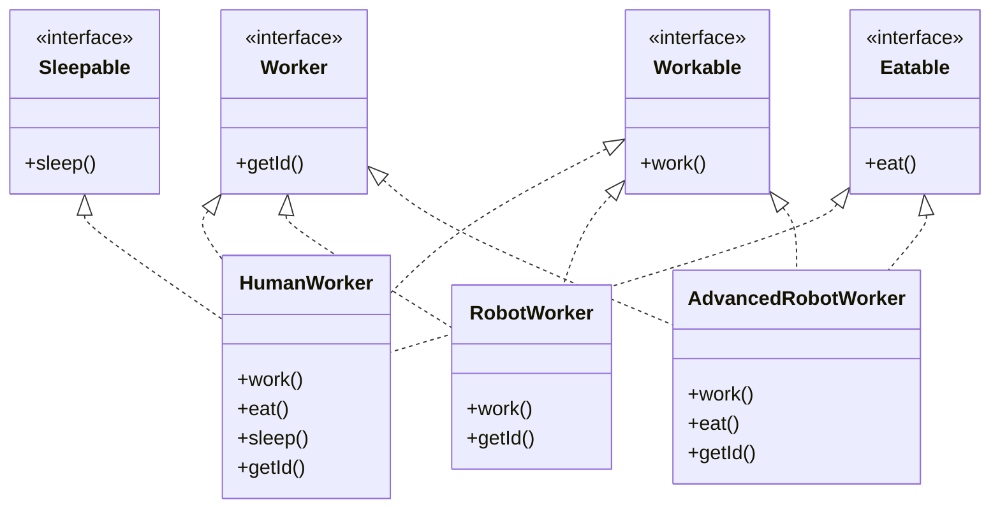
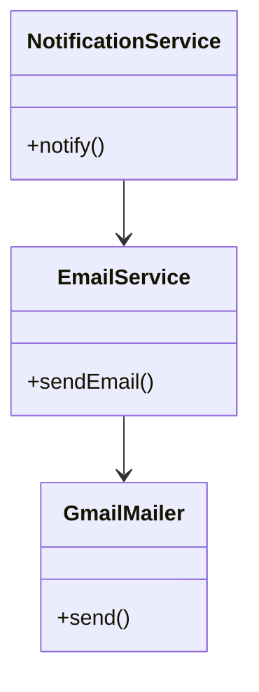
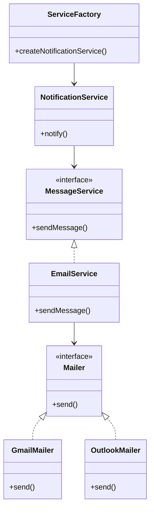

# SOLID Principles in Java: SDE2 Interview Study Guide

*Prepared for Senior Software Engineer (SDE2) Interview Preparation*

This guide provides a comprehensive exploration of SOLID design principles in Java, focusing on practical application, architectural implications, and real-world trade-offs. Designed for SDE2 candidates, it emphasizes refactoring techniques, system design integration, and interview scenarios.

## Introduction

SOLID is an acronym for five fundamental object-oriented design principles that promote maintainable, scalable, and testable software:

- **S**ingle Responsibility Principle
- **O**pen-Closed Principle
- **L**iskov Substitution Principle
- **I**nterface Segregation Principle
- **D**ependency Inversion Principle

These principles are crucial for building robust systems, whether monolithic applications or microservices architectures. They reduce coupling, improve testability, and enable easier evolution of codebases. In microservices, SOLID principles guide API design and service boundaries; in monoliths, they prevent the accumulation of technical debt.

> **Key Takeaway**: SOLID principles are not rigid rules but guidelines for better software design. Over-application can lead to unnecessary complexity.

## Single Responsibility Principle (SRP)

### Definition
**Formal**: A class should have only one reason to change, meaning it should have only one responsibility.

**Plain English**: Each class should do one thing well and have a single purpose.

### The "Why"
SRP addresses code fragility and rigidity. Classes with multiple responsibilities become "god objects" that are hard to maintain, test, and reuse. Changes in one responsibility can break others, leading to cascading failures.

### Java Implementation

#### The "Bad" Way: Violation Example
```java
// Violation: NotificationService handles multiple notification types
public class NotificationService {
    public void sendOTP(String medium) {
        if (medium.equals("email")) {
            //write email related logic
            //use JavaMailSenderAPI
        }
        if(medium.equals("mobile")){
            //write logic using twillio API
        }
    }
}
```

#### The "Good" Way: Refactored Implementation
```java
// Responsibility: Handle bank deposits and withdrawals
public class BankService {

    public long deposit(long amount, String accountNo) {
        //deposit amount
        return 0;
    }

    public long withDraw(long amount, String accountNo) {
        //withdraw amount
        return 0;
    }
}

// Responsibility: Send notifications via different mediums
public class NotificationService {
    public void sendOTP(String medium) {
        if (medium.equals("email")) {
            //write email related logic
            //use JavaMailSenderAPI
        }
        if(medium.equals("mobile")){
            //write logic using twillio API
        }
    }
}

// Responsibility: Print passbook
public class PrinterService {

    public void printPassbook() {
        //update transaction info in passbook
    }
}

// Responsibility: Provide loan interest information
public class LoanService {

    public void getLoanInterestInfo(String loanType) {
        if (loanType.equals("homeLoan")) {
            //do some job
        }
        if (loanType.equals("personalLoan")) {
            //do some job
        }
        if (loanType.equals("car")) {
            //do some job
        }
    }
}
```

### SDE2 Focus: Edge Cases & Trade-offs
- **When NOT to apply**: In simple CRUD applications or prototypes where separation adds unnecessary complexity
- **Trade-off**: More classes increase initial development time but improve long-term maintainability
- **Edge case**: Utility classes (e.g., StringUtils) can have multiple related methods if they're cohesive

### UML/Visuals: Class Diagrams

#### Before (Violation)


#### After (SRP Compliant)


## Open-Closed Principle (OCP)

### Definition
**Formal**: Software entities should be open for extension but closed for modification.

**Plain English**: You should be able to add new functionality without changing existing code.

### The "Why"
OCP prevents regression bugs and reduces the risk of introducing errors when adding features. It promotes polymorphism and abstraction over conditional logic.

### Java Implementation

#### The "Bad" Way: Violation Example
```java
// Violation: Adding new notification types requires modifying existing code
// (Imagine a monolithic NotificationService with if-else for each type)
```

#### The "Good" Way: Refactored Implementation
```java
// Abstraction: Notification service interface - open for extension
public interface Notificationservice {

    public void sendOTP(String medium);

    public void sendTransactionReport(String medium);

}

// Email notification implementation
public class EmailNotificationService implements Notificationservice {
    public void sendOTP(String medium) {
        //write logic to integrate with email api

    }

    public void sendTransactionReport(String medium) {
        //write logic to integrate with email api
    }
}

// WhatsApp notification implementation
public class WhatsAppNotificationService implements Notificationservice {

    public void sendOTP(String medium) {
        //logic to integrate whatsapp api
    }

    public void sendTransactionReport(String medium) {
//logic to integrate whatsapp api
    }
}

// Mobile notification implementation
public class MobileNotificationService implements Notificationservice {
    public void sendOTP(String medium) {
        //write the logic to send otp to mobile
        //twillo api

    }

    public void sendTransactionReport(String medium) {
        //write the logic to send otp to mobile
        //twillo api
    }
}
```

### SDE2 Focus: Edge Cases & Trade-offs
- **When NOT to apply**: For stable, unchanging codebases or when abstraction overhead outweighs benefits
- **Trade-off**: More interfaces/classes increase complexity but enable plugin architectures
- **Edge case**: Strategy pattern vs. inheritance - choose based on variability patterns

### UML/Visuals: Class Diagrams

#### Before (Violation)


#### After (OCP Compliant)


## Liskov Substitution Principle (LSP)

### Definition
**Formal**: Objects of a superclass should be replaceable with objects of its subclasses without affecting the correctness of the program.

**Plain English**: Subclasses should behave in a way that doesn't break the expectations set by the superclass.

### The "Why"
LSP ensures behavioral subtyping, preventing unexpected behavior in polymorphic code. It maintains the contract of the superclass.

### Java Implementation

#### The "Bad" Way: Violation Example
```java
// Violation: Subclasses don't support all parent methods properly
public abstract class SocialMedia {

    //@support WhatsApp,Facebook,Instagram
    public abstract  void chatWithFriend();

    //@support Facebook,Instagram
    public abstract void publishPost(Object post);

    //@support WhatsApp,Facebook,Instagram
    public abstract  void sendPhotosAndVideos();

    //@support WhatsApp,Facebook
    public abstract  void groupVideoCall(String... users);
}

public class Instagram extends SocialMedia {

    public void chatWithFriend() {

    }

    public void publishPost(Object post) {

    }

    public void sendPhotosAndVideos() {

    }

    public void groupVideoCall(String... users) {
//not applicable
    }
}
```

#### The "Good" Way: Refactored Implementation
```java
// Proper abstraction: Segregated interfaces
public interface SocialMedia {

    public   void chatWithFriend();

    public   void sendPhotosAndVideos();

}

public interface PostMediaManager {

    public  void publishPost(Object post);
}

public interface SocialVideoCallManager {
    public void groupVideoCall(String... users);
}

public class WhatsApp implements SocialMedia,SocialVideoCallManager {
    public void chatWithFriend() {

    }

    public void sendPhotosAndVideos() {

    }

    public void groupVideoCall(String... users) {

    }
}

public class Instagram implements SocialMedia,PostMediaManager{

    public void publishPost(Object post) {

    }

    public void chatWithFriend() {

    }

    public void sendPhotosAndVideos() {

    }
}
```
    public void processShapeWithPattern(Object obj) {
        if (obj instanceof Rectangle rect) {
            System.out.println("Rectangle: " + rect.getWidth() + "x" + rect.getHeight());
        } else if (obj instanceof Square square) {
            System.out.println("Square: " + square.getSide() + "x" + square.getSide());
        }
    }
}
```

### SDE2 Focus: Edge Cases & Trade-offs
- **When NOT to apply**: For final classes or when inheritance isn't needed
- **Trade-off**: More interfaces increase design complexity but ensure correct polymorphism
- **Edge case**: Method overriding should not weaken preconditions or strengthen postconditions

### UML/Visuals: Class Diagrams

#### Before (Violation)


#### After (LSP Compliant)


## Interface Segregation Principle (ISP)

### Definition
**Formal**: Clients should not be forced to depend on interfaces they do not use.

**Plain English**: Don't make interfaces too broad; split them into smaller, specific interfaces.

### The "Why"
ISP reduces coupling between classes and prevents clients from depending on methods they don't need. It promotes focused, cohesive interfaces.

### Java Implementation

#### The "Bad" Way: Violation Example
```java
// Violation: Fat interface with unrelated methods
// (Imagine a single Payment interface with all payment methods)
```

#### The "Good" Way: Refactored Implementation
```java
// Segregated interfaces for different payment features
public interface UPIPayments {

    public void payMoney();

    public void getScratchCard();


}

public interface CashBackManager {

    public void getCashBackAsCreditBalance();
}

// Google Pay implements both interfaces
public class GooglePay implements UPIPayments,CashBackManager {

    public void payMoney() {

    }

    public void getScratchCard() {

    }

    public void getCashBackAsCreditBalance() {
      //this features is there in gpay
    }
}

// Paytm implements only UPIPayments
public class Paytm implements UPIPayments {

    public void payMoney() {

    }

    public void getScratchCard() {

    }


}

// Phonepe implements only UPIPayments
public class Phonepe implements UPIPayments {
    public void payMoney() {

    }

    public void getScratchCard() {

    }


}
```
public class WorkManager {
    private final List<Workable> workers;

    public WorkManager(List<Workable> workers) {
        this.workers = workers;
    }

    public void manageWork() {
        workers.forEach(Workable::work);
    }
}

public class CafeteriaManager {
    private final List<Eatable> eaters;

    public CafeteriaManager(List<Eatable> eaters) {
        this.eaters = eaters;
    }

    public void serveLunch() {
        eaters.forEach(Eatable::eat);
    }
}
```

### SDE2 Focus: Edge Cases & Trade-offs
- **When NOT to apply**: For stable, small interfaces or when splitting increases complexity unnecessarily
- **Trade-off**: More interfaces improve modularity but can complicate client code
- **Edge case**: Role interfaces vs. header interfaces - use role interfaces for ISP compliance

### UML/Visuals: Class Diagrams

#### Before (Violation)


#### After (ISP Compliant)


## Dependency Inversion Principle (DIP)

### Definition
**Formal**: High-level modules should not depend on low-level modules. Both should depend on abstractions. Abstractions should not depend on details. Details should depend on abstractions.

**Plain English**: Depend on interfaces, not concrete classes. Inject dependencies rather than creating them.

### The "Why"
DIP enables loose coupling, easier testing, and flexibility in swapping implementations. It promotes the Dependency Injection pattern.

### Java Implementation

#### The "Bad" Way: Violation Example
```java
// Violation: High-level module depends directly on low-level modules
// (Imagine ShoppingMall creating DebitCard or CreditCard directly)
```

#### The "Good" Way: Refactored Implementation
```java
// Abstraction: BankCard interface
public interface BankCard {

    public void doTransaction(long amount);
}

// Low-level modules: Concrete implementations
public class DebitCard implements BankCard{

    public void doTransaction(long amount){
        System.out.println("payment using Debit card");
    }
}

public class CreditCard implements BankCard{

    public void doTransaction(long amount){
        System.out.println("payment using Credit card");
    }
}

// High-level module: Depends on abstraction, not concrete classes
public class ShoppingMall {

    private BankCard bankCard;

    public ShoppingMall(BankCard bankCard) {
        this.bankCard = bankCard;
    }

    public void doPurchaseSomething(long amount){
        bankCard.doTransaction(amount);
    }

    public static void main(String[] args) {
       // DebitCard debitCard=new DebitCard();
       // CreditCard creditCard=new CreditCard();

        BankCard bankCard=new CreditCard();
        ShoppingMall shoppingMall=new ShoppingMall(bankCard);
        shoppingMall.doPurchaseSomething(5000);
    }
}
```
```

### SDE2 Focus: Edge Cases & Trade-offs
- **When NOT to apply**: For simple applications or when dependencies are stable and unlikely to change
- **Trade-off**: Dependency injection adds complexity but enables better testing and flexibility
- **Edge case**: Service locator vs. dependency injection - prefer DI for testability

### UML/Visuals: Class Diagrams

#### Before (Violation)


#### After (DIP Compliant)


## System Design Context

SOLID principles extend beyond class-level design to influence high-level architecture:

### Microservices Architecture
- **SRP**: Each microservice should have a single responsibility (e.g., User Service, Order Service)
- **OCP**: Services should be extensible through API versioning without breaking existing clients
- **LSP**: API contracts must be substitutable (e.g., different implementations of the same service interface)
- **ISP**: APIs should expose only necessary endpoints; avoid bloated service interfaces
- **DIP**: Services depend on abstractions (interfaces) rather than concrete implementations

### API Design Example
```java
// ISP in API design: Segregated service interfaces
public interface UserService {
    User getUser(String id);
    List<User> getUsers();
}

public interface UserManagementService {
    void createUser(User user);
    void updateUser(User user);
    void deleteUser(String id);
}

// DIP: Controllers depend on interfaces
@RestController
public class UserController {
    private final UserService userService;
    private final UserManagementService managementService;

    public UserController(UserService userService, UserManagementService managementService) {
        this.userService = userService;
        this.managementService = managementService;
    }
}
```

### Database Design
- **SRP**: Separate read and write models (CQRS pattern)
- **OCP**: Database schemas extensible through migrations
- **ISP**: Different repositories for different entity operations

## Interview "Gotchas" & Q&A

### Single Responsibility Principle
1. **Question**: "How do you identify when a class violates SRP?"
   - **STAR Answer**: Situation: Working on a legacy UserService class handling authentication, profile management, and email notifications. Task: Refactor for better maintainability. Action: Split into UserAuthenticationService, UserProfileService, and EmailNotificationService. Result: Improved testability and reduced coupling.

2. **Question**: "What's the difference between SRP and separation of concerns?"
   - SRP focuses on classes having one reason to change, while separation of concerns is broader, applying to any level of abstraction.

### Open-Closed Principle
1. **Question**: "Explain a time you refactored code to adhere to OCP."
   - **STAR Answer**: Situation: Payment processing system with if-else chains for different payment methods. Task: Add new payment types without modifying existing code. Action: Created PaymentProcessor interface with implementations for CreditCard, PayPal, etc. Result: New payment methods added by implementing the interface.

2. **Question**: "When would you violate OCP intentionally?"
   - For stable, unchanging code or when the cost of abstraction outweighs the benefits.

### Liskov Substitution Principle
1. **Question**: "How do you ensure LSP compliance in your designs?"
   - Design by contract: Preconditions, postconditions, and invariants must be preserved in subclasses.

2. **Question**: "Give an example of LSP violation in Java collections."
   - ArrayList vs. LinkedList: Both implement List interface correctly, but have different performance characteristics.

### Interface Segregation Principle
1. **Question**: "How does ISP relate to microservices design?"
   - Each microservice should expose focused APIs rather than monolithic interfaces.

2. **Question**: "What's the trade-off of applying ISP?"
   - More interfaces improve modularity but can increase complexity and make client code harder to understand.

### Dependency Inversion Principle
1. **Question**: "How do you implement DIP in a Spring Boot application?"
   - Use @Autowired or constructor injection to inject interface dependencies rather than concrete classes.

2. **Question**: "Compare DIP with Dependency Injection."
   - DIP is a principle; DI is a pattern that implements DIP by injecting dependencies from outside.

> **Pro Tip**: In interviews, always discuss trade-offs and when you might choose not to apply a principle. Show awareness of context and practical constraints.