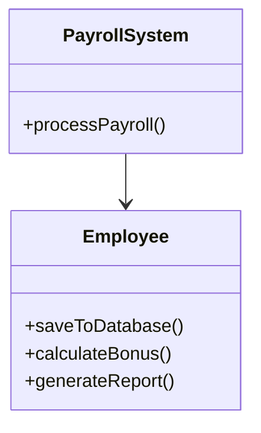
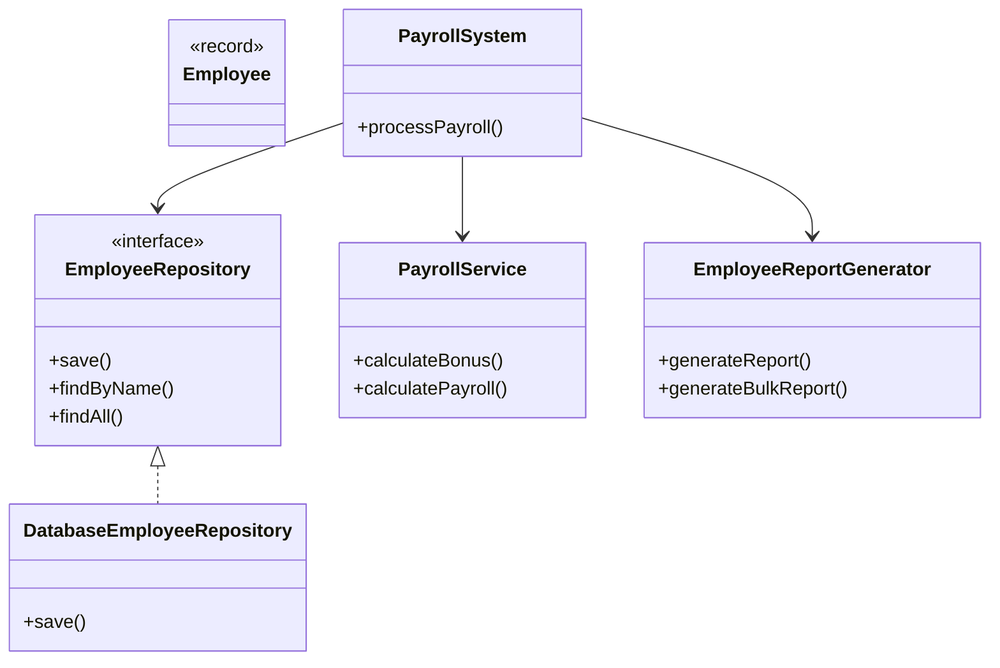
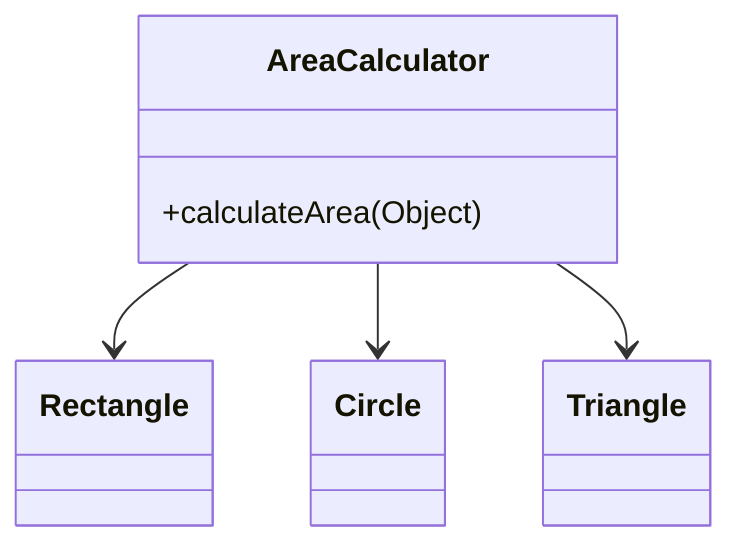
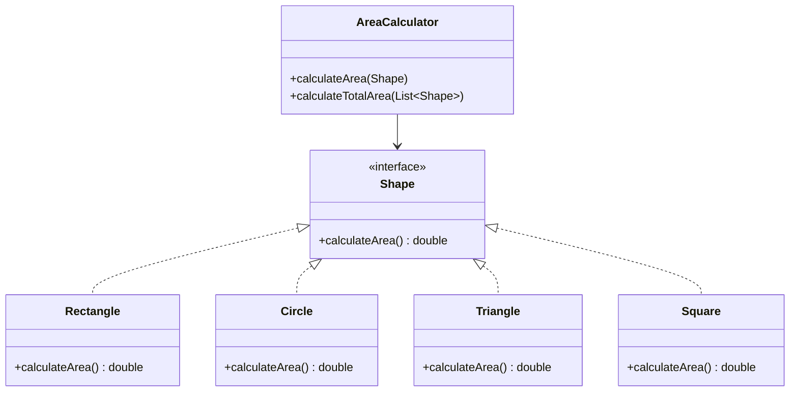
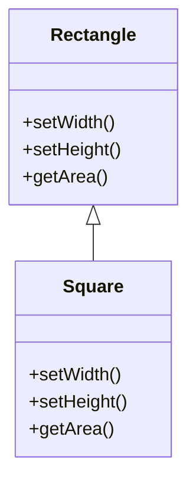
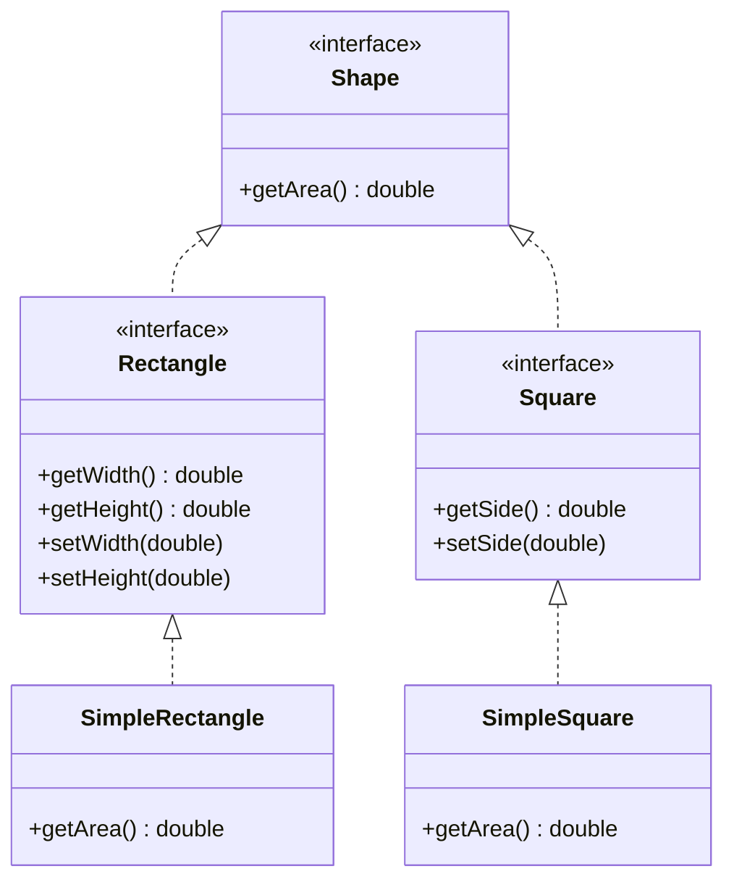
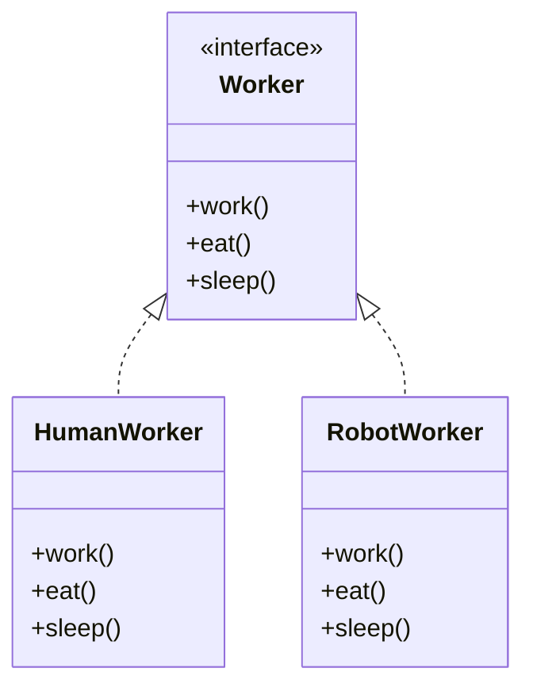
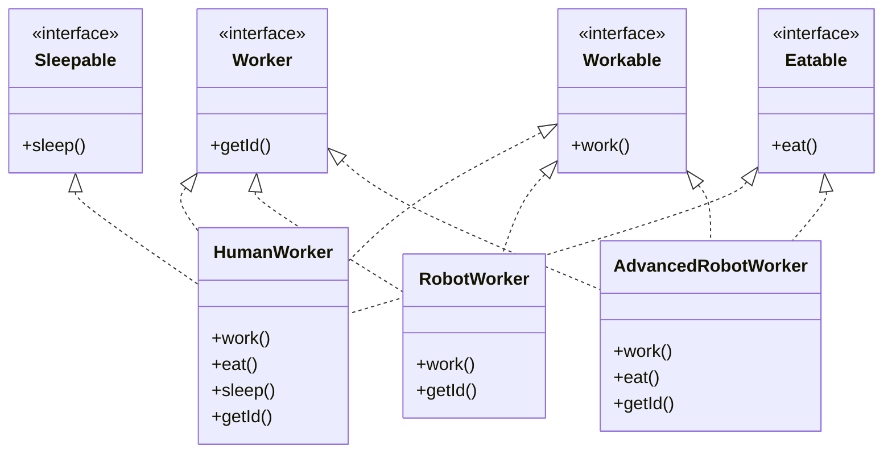
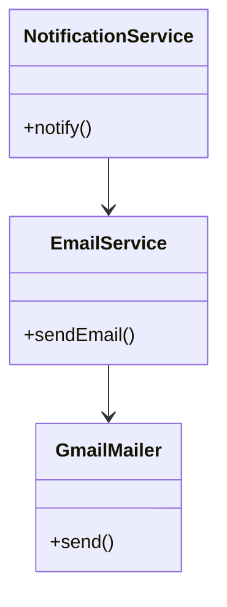
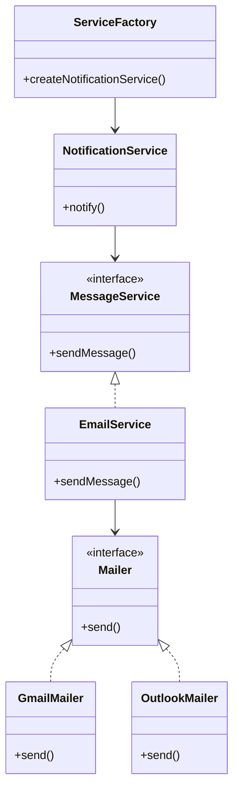

# SOLID Principles in Java: SDE2 Interview Study Guide

*Prepared for Senior Software Engineer (SDE2) Interview Preparation*

This guide provides a comprehensive exploration of SOLID design principles in Java, focusing on practical application, architectural implications, and real-world trade-offs. Designed for SDE2 candidates, it emphasizes refactoring techniques, system design integration, and interview scenarios.

## Introduction

SOLID is an acronym for five fundamental object-oriented design principles that promote maintainable, scalable, and testable software:

- **S**ingle Responsibility Principle
- **O**pen-Closed Principle
- **L**iskov Substitution Principle
- **I**nterface Segregation Principle
- **D**ependency Inversion Principle

These principles are crucial for building robust systems, whether monolithic applications or microservices architectures. They reduce coupling, improve testability, and enable easier evolution of codebases. In microservices, SOLID principles guide API design and service boundaries; in monoliths, they prevent the accumulation of technical debt.

> **Key Takeaway**: SOLID principles are not rigid rules but guidelines for better software design. Over-application can lead to unnecessary complexity.

## Single Responsibility Principle (SRP)

### Definition
**Formal**: A class should have only one reason to change, meaning it should have only one responsibility.

**Plain English**: Each class should do one thing well and have a single purpose.

### The "Why"
SRP addresses code fragility and rigidity. Classes with multiple responsibilities become "god objects" that are hard to maintain, test, and reuse. Changes in one responsibility can break others, leading to cascading failures.

### Java Implementation

#### The "Bad" Way: Violation Example
```java
// Violation: Employee class handles data, persistence, and reporting
public class Employee {
    private String name;
    private double salary;

    // Constructor and basic getters/setters omitted for brevity

    // Responsibility 1: Data persistence
    public void saveToDatabase(Connection conn) throws SQLException {
        String sql = "INSERT INTO employees (name, salary) VALUES (?, ?)";
        try (PreparedStatement stmt = conn.prepareStatement(sql)) {
            stmt.setString(1, this.name);
            stmt.setDouble(2, this.salary);
            stmt.executeUpdate();
        }
    }

    // Responsibility 2: Business logic
    public double calculateBonus() {
        return this.salary * 0.1; // 10% bonus calculation
    }

    // Responsibility 3: Reporting
    public String generateReport() {
        return String.format("Employee: %s, Salary: %.2f, Bonus: %.2f",
                           this.name, this.salary, calculateBonus());
    }
}

// Usage: Tightly coupled, hard to test individual concerns
public class PayrollSystem {
    public void processPayroll(List<Employee> employees, Connection conn) throws SQLException {
        for (Employee emp : employees) {
            emp.saveToDatabase(conn); // Direct database coupling
            System.out.println(emp.generateReport()); // Mixed concerns
        }
    }
}
```

#### The "Good" Way: Refactored Implementation
```java
// Modern Java: Using Records for immutable data
public record Employee(String name, double salary) {
    // Records automatically provide constructor, getters, equals, hashCode, toString
}

// Responsibility 1: Data persistence - Repository pattern
public interface EmployeeRepository {
    void save(Employee employee);
    Optional<Employee> findByName(String name);
    List<Employee> findAll();
}

public class DatabaseEmployeeRepository implements EmployeeRepository {
    private final DataSource dataSource; // Dependency injection

    public DatabaseEmployeeRepository(DataSource dataSource) {
        this.dataSource = dataSource;
    }

    @Override
    public void save(Employee employee) {
        String sql = "INSERT INTO employees (name, salary) VALUES (?, ?)";
        try (Connection conn = dataSource.getConnection();
             PreparedStatement stmt = conn.prepareStatement(sql)) {
            stmt.setString(1, employee.name());
            stmt.setDouble(2, employee.salary());
            stmt.executeUpdate();
        } catch (SQLException e) {
            throw new RuntimeException("Failed to save employee", e);
        }
    }

    // Other methods implemented...
}

// Responsibility 2: Business logic - Service layer
public class PayrollService {
    public double calculateBonus(Employee employee) {
        // Business rules can be complex and testable in isolation
        return employee.salary() * 0.1;
    }

    public List<PayrollRecord> calculatePayroll(List<Employee> employees) {
        return employees.stream()
                .map(emp -> new PayrollRecord(emp, calculateBonus(emp)))
                .toList();
    }
}

// Responsibility 3: Reporting - Separate concern
public class EmployeeReportGenerator {
    public String generateReport(Employee employee, double bonus) {
        return String.format("Employee: %s, Salary: %.2f, Bonus: %.2f",
                           employee.name(), employee.salary(), bonus);
    }

    public String generateBulkReport(List<PayrollRecord> records) {
        return records.stream()
                .map(record -> generateReport(record.employee(), record.bonus()))
                .collect(Collectors.joining("\n"));
    }
}

// Usage: Clean separation of concerns
public class PayrollSystem {
    private final EmployeeRepository repository;
    private final PayrollService payrollService;
    private final EmployeeReportGenerator reportGenerator;

    public PayrollSystem(EmployeeRepository repository,
                        PayrollService payrollService,
                        EmployeeReportGenerator reportGenerator) {
        this.repository = repository;
        this.payrollService = payrollService;
        this.reportGenerator = reportGenerator;
    }

    public void processPayroll(List<Employee> employees) {
        // Each component does one thing
        employees.forEach(repository::save);
        var payrollRecords = payrollService.calculatePayroll(employees);
        var report = reportGenerator.generateBulkReport(payrollRecords);
        System.out.println(report);
    }
}
```

### SDE2 Focus: Edge Cases & Trade-offs
- **When NOT to apply**: In simple CRUD applications or prototypes where separation adds unnecessary complexity
- **Trade-off**: More classes increase initial development time but improve long-term maintainability
- **Edge case**: Utility classes (e.g., StringUtils) can have multiple related methods if they're cohesive

### UML/Visuals: Class Diagrams

#### Before (Violation)


#### After (SRP Compliant)


## Open-Closed Principle (OCP)

### Definition
**Formal**: Software entities should be open for extension but closed for modification.

**Plain English**: You should be able to add new functionality without changing existing code.

### The "Why"
OCP prevents regression bugs and reduces the risk of introducing errors when adding features. It promotes polymorphism and abstraction over conditional logic.

### Java Implementation

#### The "Bad" Way: Violation Example
```java
// Violation: Adding new shapes requires modifying existing code
public class AreaCalculator {
    public double calculateArea(Object shape) {
        if (shape instanceof Rectangle) {
            Rectangle rect = (Rectangle) shape;
            return rect.getWidth() * rect.getHeight();
        } else if (shape instanceof Circle) {
            Circle circle = (Circle) shape;
            return Math.PI * Math.pow(circle.getRadius(), 2);
        } else if (shape instanceof Triangle) {
            Triangle triangle = (Triangle) shape;
            return 0.5 * triangle.getBase() * triangle.getHeight();
        }
        throw new IllegalArgumentException("Unsupported shape");
    }
}

// Adding a new shape breaks OCP
public class Rectangle { /* getters/setters */ }
public class Circle { /* getters/setters */ }
public class Triangle { /* getters/setters */ }
```

#### The "Good" Way: Refactored Implementation
```java
// Abstraction: Shape interface
public interface Shape {
    double calculateArea();
}

// Concrete implementations
public record Rectangle(double width, double height) implements Shape {
    @Override
    public double calculateArea() {
        return width * height;
    }
}

public record Circle(double radius) implements Shape {
    @Override
    public double calculateArea() {
        return Math.PI * radius * radius;
    }
}

public record Triangle(double base, double height) implements Shape {
    @Override
    public double calculateArea() {
        return 0.5 * base * height;
    }
}

// New shape: Easy extension without modification
public record Square(double side) implements Shape {
    @Override
    public double calculateArea() {
        return side * side;
    }
}

// OCP-compliant calculator
public class AreaCalculator {
    public double calculateArea(Shape shape) {
        return shape.calculateArea();
    }

    // Modern Java: Streams for bulk operations
    public double calculateTotalArea(List<Shape> shapes) {
        return shapes.stream()
                .mapToDouble(Shape::calculateArea)
                .sum();
    }

    // Functional interface for custom calculations
    public double calculateWithFilter(List<Shape> shapes,
                                    Predicate<Shape> filter,
                                    Function<Shape, Double> calculator) {
        return shapes.stream()
                .filter(filter)
                .mapToDouble(calculator::apply)
                .sum();
    }
}
```

### SDE2 Focus: Edge Cases & Trade-offs
- **When NOT to apply**: For stable, unchanging codebases or when abstraction overhead outweighs benefits
- **Trade-off**: More interfaces/classes increase complexity but enable plugin architectures
- **Edge case**: Strategy pattern vs. inheritance - choose based on variability patterns

### UML/Visuals: Class Diagrams

#### Before (Violation)


#### After (OCP Compliant)


## Liskov Substitution Principle (LSP)

### Definition
**Formal**: Objects of a superclass should be replaceable with objects of its subclasses without affecting the correctness of the program.

**Plain English**: Subclasses should behave in a way that doesn't break the expectations set by the superclass.

### The "Why"
LSP ensures behavioral subtyping, preventing unexpected behavior in polymorphic code. It maintains the contract of the superclass.

### Java Implementation

#### The "Bad" Way: Violation Example
```java
// Violation: Square breaks Rectangle's behavior
public class Rectangle {
    protected double width;
    protected double height;

    public void setWidth(double width) {
        this.width = width;
    }

    public void setHeight(double height) {
        this.height = height;
    }

    public double getArea() {
        return width * height;
    }
}

public class Square extends Rectangle {
    @Override
    public void setWidth(double width) {
        super.setWidth(width);
        super.setHeight(width); // Violates LSP: changes height when setting width
    }

    @Override
    public void setHeight(double height) {
        super.setWidth(height); // Violates LSP: changes width when setting height
        super.setHeight(height);
    }
}

// Client code that expects Rectangle behavior
public class AreaCalculator {
    public void printArea(Rectangle rect) {
        rect.setWidth(5);
        rect.setHeight(10);
        System.out.println("Expected: 50, Actual: " + rect.getArea());
    }
}
```

#### The "Good" Way: Refactored Implementation
```java
// Proper abstraction hierarchy
public interface Shape {
    double getArea();
}

public interface Rectangle extends Shape {
    double getWidth();
    double getHeight();
    void setWidth(double width);
    void setHeight(double height);
}

public interface Square extends Shape {
    double getSide();
    void setSide(double side);
}

// LSP-compliant Rectangle implementation
public class SimpleRectangle implements Rectangle {
    private double width;
    private double height;

    public SimpleRectangle(double width, double height) {
        this.width = width;
        this.height = height;
    }

    @Override
    public double getWidth() { return width; }

    @Override
    public double getHeight() { return height; }

    @Override
    public void setWidth(double width) { this.width = width; }

    @Override
    public void setHeight(double height) { this.height = height; }

    @Override
    public double getArea() { return width * height; }
}

// LSP-compliant Square implementation
public class SimpleSquare implements Square {
    private double side;

    public SimpleSquare(double side) {
        this.side = side;
    }

    @Override
    public double getSide() { return side; }

    @Override
    public void setSide(double side) { this.side = side; }

    @Override
    public double getArea() { return side * side; }
}

// Generic shape processor - works with any Shape
public class ShapeProcessor {
    public void processShape(Shape shape) {
        System.out.println("Area: " + shape.getArea());
    }

    // Modern Java: Pattern matching (preview feature)
    public void processShapeWithPattern(Object obj) {
        if (obj instanceof Rectangle rect) {
            System.out.println("Rectangle: " + rect.getWidth() + "x" + rect.getHeight());
        } else if (obj instanceof Square square) {
            System.out.println("Square: " + square.getSide() + "x" + square.getSide());
        }
    }
}
```

### SDE2 Focus: Edge Cases & Trade-offs
- **When NOT to apply**: For final classes or when inheritance isn't needed
- **Trade-off**: More interfaces increase design complexity but ensure correct polymorphism
- **Edge case**: Method overriding should not weaken preconditions or strengthen postconditions

### UML/Visuals: Class Diagrams

#### Before (Violation)


#### After (LSP Compliant)


## Interface Segregation Principle (ISP)

### Definition
**Formal**: Clients should not be forced to depend on interfaces they do not use.

**Plain English**: Don't make interfaces too broad; split them into smaller, specific interfaces.

### The "Why"
ISP reduces coupling between classes and prevents clients from depending on methods they don't need. It promotes focused, cohesive interfaces.

### Java Implementation

#### The "Bad" Way: Violation Example
```java
// Violation: Fat interface with unrelated methods
public interface Worker {
    void work();
    void eat();
    void sleep();
}

// Human worker needs all methods
public class HumanWorker implements Worker {
    @Override
    public void work() { System.out.println("Human working"); }

    @Override
    public void eat() { System.out.println("Human eating"); }

    @Override
    public void sleep() { System.out.println("Human sleeping"); }
}

// Robot worker doesn't need eat/sleep
public class RobotWorker implements Worker {
    @Override
    public void work() { System.out.println("Robot working"); }

    @Override
    public void eat() { throw new UnsupportedOperationException(); }

    @Override
    public void sleep() { throw new UnsupportedOperationException(); }
}
```

#### The "Good" Way: Refactored Implementation
```java
// Segregated interfaces
public interface Workable {
    void work();
}

public interface Eatable {
    void eat();
}

public interface Sleepable {
    void sleep();
}

// Modern Java: Sealed classes for controlled inheritance (Java 17+)
public sealed interface Worker permits HumanWorker, RobotWorker, AdvancedRobotWorker {
    // Common worker properties if needed
    String getId();
}

public final class HumanWorker implements Worker, Workable, Eatable, Sleepable {
    private final String id;

    public HumanWorker(String id) { this.id = id; }

    @Override
    public String getId() { return id; }

    @Override
    public void work() { System.out.println("Human working"); }

    @Override
    public void eat() { System.out.println("Human eating"); }

    @Override
    public void sleep() { System.out.println("Human sleeping"); }
}

public final class RobotWorker implements Worker, Workable {
    private final String id;

    public RobotWorker(String id) { this.id = id; }

    @Override
    public String getId() { return id; }

    @Override
    public void work() { System.out.println("Robot working"); }
}

public final class AdvancedRobotWorker implements Worker, Workable, Eatable {
    private final String id;

    public AdvancedRobotWorker(String id) { this.id = id; }

    @Override
    public String getId() { return id; }

    @Override
    public void work() { System.out.println("Advanced robot working"); }

    @Override
    public void eat() { System.out.println("Advanced robot recharging"); }
}

// Usage: Clients depend only on what they need
public class WorkManager {
    private final List<Workable> workers;

    public WorkManager(List<Workable> workers) {
        this.workers = workers;
    }

    public void manageWork() {
        workers.forEach(Workable::work);
    }
}

public class CafeteriaManager {
    private final List<Eatable> eaters;

    public CafeteriaManager(List<Eatable> eaters) {
        this.eaters = eaters;
    }

    public void serveLunch() {
        eaters.forEach(Eatable::eat);
    }
}
```

### SDE2 Focus: Edge Cases & Trade-offs
- **When NOT to apply**: For stable, small interfaces or when splitting increases complexity unnecessarily
- **Trade-off**: More interfaces improve modularity but can complicate client code
- **Edge case**: Role interfaces vs. header interfaces - use role interfaces for ISP compliance

### UML/Visuals: Class Diagrams

#### Before (Violation)


#### After (ISP Compliant)


## Dependency Inversion Principle (DIP)

### Definition
**Formal**: High-level modules should not depend on low-level modules. Both should depend on abstractions. Abstractions should not depend on details. Details should depend on abstractions.

**Plain English**: Depend on interfaces, not concrete classes. Inject dependencies rather than creating them.

### The "Why"
DIP enables loose coupling, easier testing, and flexibility in swapping implementations. It promotes the Dependency Injection pattern.

### Java Implementation

#### The "Bad" Way: Violation Example
```java
// Violation: High-level module depends on low-level module
public class EmailService {
    private final GmailMailer mailer; // Direct dependency on concrete class

    public EmailService() {
        this.mailer = new GmailMailer(); // Tight coupling
    }

    public void sendEmail(String message) {
        mailer.send(message);
    }
}

public class GmailMailer {
    public void send(String message) {
        System.out.println("Sending via Gmail: " + message);
    }
}

// High-level module depends on low-level details
public class NotificationService {
    private final EmailService emailService;

    public NotificationService() {
        this.emailService = new EmailService(); // Can't test or change easily
    }

    public void notify(String message) {
        emailService.sendEmail(message);
    }
}
```

#### The "Good" Way: Refactored Implementation
```java
// Abstractions: Interfaces for dependencies
public interface MessageService {
    void sendMessage(String message);
}

public interface Mailer {
    void send(String message);
}

// Low-level modules implement abstractions
public class GmailMailer implements Mailer {
    @Override
    public void send(String message) {
        System.out.println("Sending via Gmail: " + message);
    }
}

public class OutlookMailer implements Mailer {
    @Override
    public void send(String message) {
        System.out.println("Sending via Outlook: " + message);
    }
}

public class EmailService implements MessageService {
    private final Mailer mailer;

    // Dependency injection via constructor
    public EmailService(Mailer mailer) {
        this.mailer = mailer;
    }

    @Override
    public void sendMessage(String message) {
        mailer.send(message);
    }
}

// High-level module depends on abstractions
public class NotificationService {
    private final MessageService messageService;

    public NotificationService(MessageService messageService) {
        this.messageService = messageService;
    }

    public void notify(String message) {
        messageService.sendMessage(message);
    }
}

// Modern Java: Records for configuration
public record NotificationConfig(String smtpHost, int port, String protocol) {}

// Factory for creating services with dependencies
public class ServiceFactory {
    public static NotificationService createNotificationService(Mailer mailer) {
        MessageService emailService = new EmailService(mailer);
        return new NotificationService(emailService);
    }

    // Using Optional for optional dependencies
    public static NotificationService createWithFallback(Mailer primary, Optional<Mailer> fallback) {
        MessageService service = new CompositeMessageService(primary, fallback);
        return new NotificationService(service);
    }
}

// Composite pattern for multiple implementations
public class CompositeMessageService implements MessageService {
    private final Mailer primary;
    private final Optional<Mailer> fallback;

    public CompositeMessageService(Mailer primary, Optional<Mailer> fallback) {
        this.primary = primary;
        this.fallback = fallback;
    }

    @Override
    public void sendMessage(String message) {
        try {
            primary.send(message);
        } catch (Exception e) {
            fallback.ifPresent(mailer -> mailer.send(message));
        }
    }
}
```

### SDE2 Focus: Edge Cases & Trade-offs
- **When NOT to apply**: For simple applications or when dependencies are stable and unlikely to change
- **Trade-off**: Dependency injection adds complexity but enables better testing and flexibility
- **Edge case**: Service locator vs. dependency injection - prefer DI for testability

### UML/Visuals: Class Diagrams

#### Before (Violation)


#### After (DIP Compliant)


## System Design Context

SOLID principles extend beyond class-level design to influence high-level architecture:

### Microservices Architecture
- **SRP**: Each microservice should have a single responsibility (e.g., User Service, Order Service)
- **OCP**: Services should be extensible through API versioning without breaking existing clients
- **LSP**: API contracts must be substitutable (e.g., different implementations of the same service interface)
- **ISP**: APIs should expose only necessary endpoints; avoid bloated service interfaces
- **DIP**: Services depend on abstractions (interfaces) rather than concrete implementations

### API Design Example
```java
// ISP in API design: Segregated service interfaces
public interface UserService {
    User getUser(String id);
    List<User> getUsers();
}

public interface UserManagementService {
    void createUser(User user);
    void updateUser(User user);
    void deleteUser(String id);
}

// DIP: Controllers depend on interfaces
@RestController
public class UserController {
    private final UserService userService;
    private final UserManagementService managementService;

    public UserController(UserService userService, UserManagementService managementService) {
        this.userService = userService;
        this.managementService = managementService;
    }
}
```

### Database Design
- **SRP**: Separate read and write models (CQRS pattern)
- **OCP**: Database schemas extensible through migrations
- **ISP**: Different repositories for different entity operations

## Interview "Gotchas" & Q&A

### Single Responsibility Principle
1. **Question**: "How do you identify when a class violates SRP?"
   - **STAR Answer**: Situation: Working on a legacy UserService class handling authentication, profile management, and email notifications. Task: Refactor for better maintainability. Action: Split into UserAuthenticationService, UserProfileService, and EmailNotificationService. Result: Improved testability and reduced coupling.

2. **Question**: "What's the difference between SRP and separation of concerns?"
   - SRP focuses on classes having one reason to change, while separation of concerns is broader, applying to any level of abstraction.

### Open-Closed Principle
1. **Question**: "Explain a time you refactored code to adhere to OCP."
   - **STAR Answer**: Situation: Payment processing system with if-else chains for different payment methods. Task: Add new payment types without modifying existing code. Action: Created PaymentProcessor interface with implementations for CreditCard, PayPal, etc. Result: New payment methods added by implementing the interface.

2. **Question**: "When would you violate OCP intentionally?"
   - For stable, unchanging code or when the cost of abstraction outweighs the benefits.

### Liskov Substitution Principle
1. **Question**: "How do you ensure LSP compliance in your designs?"
   - Design by contract: Preconditions, postconditions, and invariants must be preserved in subclasses.

2. **Question**: "Give an example of LSP violation in Java collections."
   - ArrayList vs. LinkedList: Both implement List interface correctly, but have different performance characteristics.

### Interface Segregation Principle
1. **Question**: "How does ISP relate to microservices design?"
   - Each microservice should expose focused APIs rather than monolithic interfaces.

2. **Question**: "What's the trade-off of applying ISP?"
   - More interfaces improve modularity but can increase complexity and make client code harder to understand.

### Dependency Inversion Principle
1. **Question**: "How do you implement DIP in a Spring Boot application?"
   - Use @Autowired or constructor injection to inject interface dependencies rather than concrete classes.

2. **Question**: "Compare DIP with Dependency Injection."
   - DIP is a principle; DI is a pattern that implements DIP by injecting dependencies from outside.

> **Pro Tip**: In interviews, always discuss trade-offs and when you might choose not to apply a principle. Show awareness of context and practical constraints.